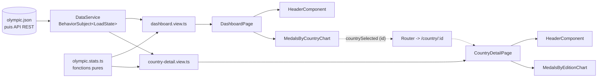

# Architecture

Ce document décrit l'organisation du front-end tel qu'il est aujourd'hui. Le raisonnement qui y a mené, et l'analyse du code de départ qui l'a motivé, sont dans [notes-architecture.md](notes-architecture.md).

## Principe

Une seule règle explique presque tout le reste : chaque fichier a une responsabilité qu'on peut formuler en une phrase.

Le service sait où sont les données. Les fonctions de calcul savent ce qu'est un total de médailles. Les fonctions de vue savent ce que la page doit afficher. Les composants affichent. Les pages orchestrent.

## Arborescence

```
src/app/
├── app.module.ts              déclare les composants, fournit HttpClient
├── app-routing.module.ts      '' | country/:id | **
├── app.constants.ts           messages, palette des graphiques, segment de route
├── app.component.*            layout commun (bandeau, <main>), déclenche le chargement
│
├── models/
│   ├── olympic.ts             { id, country, participations }
│   ├── participation.ts       { id, year, city, medalsCount, athleteCount }
│   ├── indicator.ts           { label, value } — ce qu'affiche le header
│   └── load-state.ts          loading | loaded<T> | empty | error
│
├── services/
│   ├── data.service.ts        seule porte d'entrée des données
│   └── olympic.stats.ts       calculs purs (totaux, agrégats par pays, par édition)
│
├── components/
│   ├── header/                titre + liste d'indicateurs
│   ├── status-message/        chargement, absence de données, erreur + « Retry »
│   ├── medals-by-country-chart/   camembert, émet l'id du pays choisi
│   └── medals-by-edition-chart/   courbe des médailles par édition
│
└── pages/
    ├── dashboard-page/        composant + dashboard.view.ts
    ├── country-detail-page/   composant + country-detail.view.ts
    └── not-found/
```

Il n'y a ni `core/` ni `shared/`. Le cahier des charges impose le chemin `src/app/services/data.service.ts`, et l'énoncé demande de ne pas multiplier les niveaux de dossiers. Pour huit composants et un service, quatre dossiers suffisent.

## Le chemin d'une donnée



`AppComponent` appelle `DataService.load()` une fois au démarrage. Le service publie son état dans un `BehaviorSubject`, que les deux pages consomment avec le pipe `async`. Aucun composant n'appelle `subscribe`, donc il n'y a aucun abonnement à nettoyer.

La page de détail compose le paramètre de route et les données avec `switchMap` : changer d'identifiant sans quitter la page recharge bien l'affichage.

## Le service

```ts
readonly olympics$: Observable<LoadState<Olympic[]>>;
getOlympicById(id: number): Observable<LoadState<Olympic | undefined>>;
load(): void;
```

`load()` est public parce que le bouton « Retry » de l'écran d'erreur doit pouvoir relancer un chargement.

`getOlympicById` renvoie volontairement `Olympic | undefined`. Un identifiant absent du mock aujourd'hui, et un 404 de l'API demain, produisent alors le même cas, traité au même endroit.

## Les fonctions de vue

Chaque page a un fichier `*.view.ts` avec une fonction pure qui prend l'état du service et rend un objet plat : statut, titre, indicateurs, données du graphique, message.

La page se résume alors à une ligne :

```ts
this.view$ = this.data.olympics$.pipe(map(toDashboardView));
```

Le template lit `view.indicators` ou `view.message` sans avoir à savoir dans quel cas de l'union il se trouve, et tout ce qui décide de l'affichage se teste sans TestBed, sans HttpClient et sans routeur.

## Les patterns

Le **Singleton**, via `@Injectable({ providedIn: 'root' })` : une seule instance de `DataService`, donc un seul chargement pour toute la session.

L'**Observer**, via RxJS : le service pousse ses états, les pages s'y abonnent par le pipe `async`, et le rechargement consiste à pousser un nouvel état dans le même flux.

La **séparation composant/service**, qui structure tout le reste : le service sait où sont les données, les fonctions pures les calculent, les pages orchestrent, les composants affichent.

Deux patterns sont volontairement absents. L'**Adapter** serait la bonne réponse si le format du serveur cessait de correspondre aux interfaces ; aujourd'hui le JSON leur correspond exactement, donc il ne traduirait rien. Le **Decorator** est utilisé sans être écrit : `@Component`, `@Injectable`, `@Input` et `@Output` en sont, et Angular les fournit.

À noter pour éviter un malentendu : `LoadState` modélise un état par une union de types, ce qui n'est pas le State Pattern, où un objet délègue son comportement à un objet d'état.

## Le jour où l'API remplace le mock

`src/environments/environment.ts` et `environment.prod.ts` : l'URL change. Le remplacement de fichier est déjà configuré dans `angular.json`.

`data.service.ts` : la requête pointe vers l'endpoint, et `getOlympicById` peut devenir un vrai `GET /olympics/:id`. Son type de retour ne bouge pas.

`olympic.stats.ts` : inchangé, sauf si le serveur renvoie déjà les agrégats, auquel cas des fonctions disparaissent.

`components/` et `pages/` : aucun changement. C'est le critère qui compte. Si un changement d'API obligeait à modifier un composant, la frontière serait au mauvais endroit.

Si la réponse du serveur diverge des interfaces, l'adaptateur s'insère à un seul endroit : `http.get<unknown>()` suivi d'un `map(toOlympics)` dans le service.

## Ce que l'architecture n'inclut pas

Pas de lazy loading : trois routes et un bundle sous le mégaoctet. Pas de store : un `BehaviorSubject` suffit tant qu'il n'y a qu'une source de données et aucune écriture. Pas de guard ni de resolver : la vérification de l'existence du pays est faite par la fonction de vue, et un resolver retarderait l'affichage sans améliorer le message. Pas de `SharedModule` ni de `CoreModule` : avec huit composants dans un seul module, ils n'ajouteraient que de l'indirection.

Ces choix se réexaminent : le lazy loading à partir de plusieurs sections indépendantes, le store dès que l'utilisateur modifiera des données, les modules séparés quand plusieurs personnes travailleront sur le même dépôt.

## Conventions

Les composants ne connaissent ni `HttpClient` ni le routeur ; ils reçoivent des données par `@Input` et signalent les intentions par `@Output`.

Les templates utilisent les blocs `@if`, `@for` et `@switch` d'Angular 17+.

Chaque graphique est doublé d'un tableau de données dans un `<details>`, avec un `aria-label` sur le canvas. C'est ce tableau qui rend le détail d'un pays atteignable au clavier.

Les couleurs et les espacements sont des variables CSS définies dans `styles.scss`. Les composants ne connaissent pas les points de rupture : ils lisent `--chart-height`, que les media queries redéfinissent.

ESLint fait respecter deux contraintes du cahier des charges : aucun `any` et 300 lignes par fichier au maximum.
