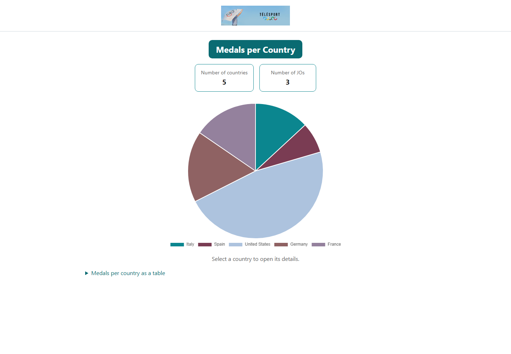
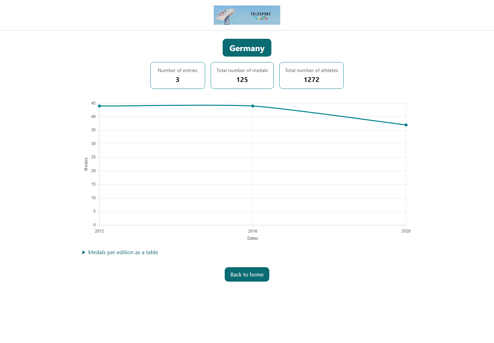
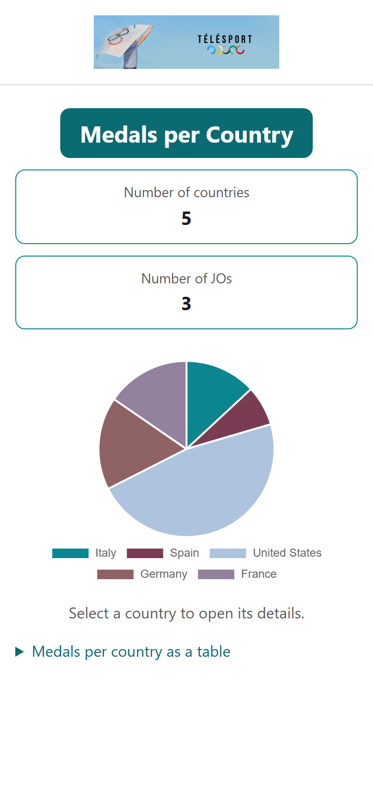
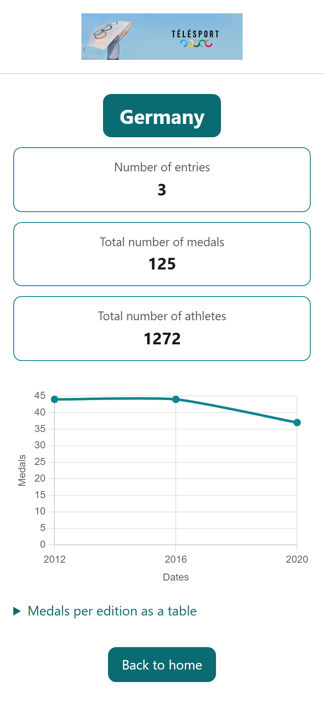

# TéléSport — Jeux olympiques

Application Angular qui présente l'historique des Jeux olympiques pour la chaîne TéléSport : un tableau de bord des médailles par pays, et une page de détail par pays.

Projet 2 du parcours Lead Développeur Full-Stack Java/Angular (OpenClassrooms).

## Sommaire

- [Prérequis](#prérequis)
- [Installation et lancement](#installation-et-lancement)
- [Les pages](#les-pages)
- [Structure du projet](#structure-du-projet)
- [Captures d'écran](#captures-décran)
- [Choix techniques](#choix-techniques)
- [Documentation](#documentation)

## Prérequis

- Node.js 18.19, 20.11 ou 22 — ce sont les versions supportées par Angular 18. Node 24 fait tourner le projet, mais avec un avertissement et des plantages possibles du serveur de développement.
- npm 9 ou plus récent.
- Angular CLI 18 : inutile de l'installer globalement, les commandes ci-dessous passent par le CLI du projet.

## Installation et lancement

```bash
npm ci
npm start
```

L'application est servie sur http://localhost:4200 et se recharge à chaque modification.

```bash
npm run build   # build de production dans dist/
npm run lint    # ESLint sur le TypeScript et les templates
```

## Les pages

| Route | Contenu |
| --- | --- |
| `/` | Nombre de pays, nombre d'éditions, et un camembert des médailles. Un clic sur un pays ouvre son détail. |
| `/country/:id` | Participations, total de médailles, total d'athlètes, courbe par édition, et un bouton de retour. |
| toute autre URL | Page 404. Un identifiant de pays inexistant y mène aussi. |

## Structure du projet

```
src/app/
├── models/        les formes de données : Olympic, Participation, Indicator, LoadState
├── services/      DataService (les données) et olympic.stats.ts (les calculs)
├── components/    header, messages d'état, les deux graphiques
├── pages/         dashboard, détail d'un pays, 404
└── app.*          module, routage, layout commun, constantes
src/assets/mock/   olympic.json, la source de données
```

## Captures d'écran

| Dashboard | Détail d'un pays |
| --- | --- |
|  |  |
|  |  |

## Choix techniques

Les données ne sont chargées qu'une fois par session. `DataService` les publie dans un `BehaviorSubject` que les deux pages lisent, au lieu de refaire une requête à chaque navigation.

L'URL de détail porte l'identifiant du pays et non son nom, parce que c'est ce qu'exposera l'API du projet suivant.

Les libellés de l'interface sont en anglais, comme les maquettes.

Le projet reste en NgModule, conformément aux consignes de l'exercice. Les schematics du CLI sont configurés en `standalone: false` pour que `ng generate` produise des composants déclarables dans `AppModule`.

Il n'y a pas de tests automatisés : l'énoncé n'en attend pas, les vérifications se font à la main.

## Documentation

- [ARCHITECTURE.md](ARCHITECTURE.md) — la structure, les composants, le service, et ce qui changera le jour du branchement sur l'API.
- [notes-architecture.md](notes-architecture.md) — l'analyse du code de départ et les choix d'architecture.
