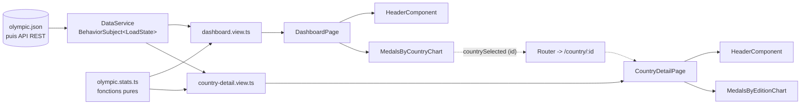

# Notes d'architecture — TéléSport

Mes notes d'analyse du starter Angular de TéléSport (projet 2, OpenClassrooms).

L'étape 1 consiste à comprendre le code existant et à lister ce qui ne va pas, sans rien modifier. L'étape 2 consiste à décider de l'architecture cible, toujours sans toucher au code. Les deux sont dans ce document : l'analyse d'abord, l'architecture ensuite, et à la fin ce que la refactorisation de l'étape 3 a changé au plan.

## Comment j'ai analysé le projet

J'ai d'abord installé les dépendances avec `npm ci`, puis lancé `ng serve` pour voir à quoi ressemble l'application. J'ai cliqué partout, je me suis mis en mobile, et j'ai tapé des URL à la main pour voir ce qui casse : `/country/Atlantide`, `/country/1`, `/nimporte-quoi`. Ensuite seulement j'ai lu les fichiers, un par un, en les comparant aux spécifications de Jeannette.

Versions en place : Angular 18.2.13, CLI 18.2.20, TypeScript 5.4, RxJS 7.8, Chart.js 4. Sur ma machine, Node 24 et npm 11.

Ce que donnent les commandes du CLI :

| Commande | Résultat |
|---|---|
| `ng serve` | Démarre. Avertissement : « Node 24.12.0 (Unsupported) » |
| `ng build` | Passe. Avertissement sur la `target` du `tsconfig.json` |
| `ng test` | Ne compile pas. `app.component.spec.ts:26` : `Property 'title' does not exist on type 'AppComponent'` |
| `ng lint` | Impossible, aucun linter installé : `Cannot find "lint" target` |
| `npm audit` | 81 vulnérabilités (3 critiques, 45 élevées), dont 9 en production |

## Ce que contient le projet

```
src/app/
├── app.component.*           # juste un <router-outlet>
├── app.module.ts             # déclare les 3 pages + provideHttpClient()
├── app-routing.module.ts     # '', 'country/:countryName', 'not-found', '**'
└── pages/
    ├── home/                 # requête HTTP + calculs + camembert + HTML
    ├── country/              # requête HTTP + calculs + courbe + HTML
    └── not-found/
src/assets/mock/olympic.json  # 5 pays, 3 participations chacun (2012, 2016, 2020)
src/styles.scss               # les styles des en-têtes et des KPIs, en global
```

Pas de `components/`, pas de `services/`, pas de `models/`. Le README du starter décrit pourtant un dossier `core/`, un `olympic.service.ts` et deux fichiers de modèles : rien de tout ça n'existe dans le dépôt. J'ai cherché deux fois avant de comprendre que le README mentait.

Un point qui m'a surpris : les fichiers sont courts, 70 lignes au maximum. Je m'attendais à trouver un composant de 400 lignes. Le problème est ailleurs. Chaque page fait tout, de la requête HTTP jusqu'à l'affichage, et les deux pages font la même chose chacune de leur côté.

Et l'application marche. `ng build` passe, l'accueil affiche 5 pays et 3 JO avec son camembert, un clic ouvre la page du pays, « Go back » revient à l'accueil, une URL inconnue tombe sur la 404. Tant qu'on suit le chemin prévu, rien ne se plaint.

## Ce que j'ai vu en testant

| Ce que j'ai fait | Ce que j'ai obtenu |
|---|---|
| Clic sur « United States » | `/country/United%20States`, alors que la spec demande `/country/:id` |
| `/country/Atlantide`, puis `/country/1` | `TypeError` dans la console, badge de titre vide, KPIs à 0, aucun message pour l'utilisateur |
| Passage accueil → page pays | Le titre « Olympic games app » et le `<hr>` disparaissent : l'en-tête n'est pas le même |
| Affichage en 375 px | Camembert haut de 143 px seulement, libellés des KPIs sur trois lignes |
| Lecture du graphique pays | La courbe est gris clair, de la même couleur que la grille. Je ne l'avais pas vue au premier coup d'œil |
| `/nimporte-quoi` | La page 404 s'affiche, avec deux barres de défilement inutiles |
| Ouverture de la console sur l'accueil | Tout le JSON est recraché par un `console.log` |
| Navigation au clavier depuis l'accueil | Aucun élément ne prend le focus, donc aucun moyen d'ouvrir une page pays |

## Les problèmes

J'ai classé chaque problème selon trois niveaux. Critique : c'est un bug visible ou un critère d'acceptation qui saute. Majeur : ça marche, mais ça va coûter cher à maintenir ou bloquer le branchement de l'API. Mineur : propreté et cohérence.

Les numéros (A1, B2...) me servent à m'y retrouver quand j'en parle avec mon mentor.

| # | Problème | Gravité |
|---|---|---|
| A1 | Les pages appellent `HttpClient` elles-mêmes, aucun service | Critique |
| A2 | Aucun modèle de données | Critique |
| A3 | Calculs métier dans les composants | Majeur |
| A4 | En-tête, récupération et graphiques dupliqués | Majeur |
| A5 | URL du mock en dur, environnements inutilisés | Majeur |
| A6 | Aucun composant réutilisable ni layout commun | Mineur |
| A7 | Noms des pages éloignés de la spec | Mineur |
| A8 | README trompeur, pas d'`ARCHITECTURE.md` | Mineur |
| B1 | Route par nom de pays au lieu de l'id | Critique |
| B2 | Pays inexistant : plantage sans message | Critique |
| B3 | Paramètre de route lu par effet de bord | Majeur |
| B4 | Lien retour au lieu du bouton demandé | Mineur |
| C1 | 19 `any` | Critique |
| C2 | Conversions nombre vers texte vers nombre | Majeur |
| C3 | Déclarations de propriétés incohérentes | Mineur |
| D1 | Erreurs jamais affichées | Critique |
| D2 | Aucun état de chargement ni état vide | Critique |
| D3 | Abonnements manuels, sans nettoyage ni composition | Majeur |
| D4 | Syntaxe RxJS dépréciée, `.pipe()` vides | Mineur |
| E1 | Canvas ciblé par id global, graphiques jamais détruits | Majeur |
| E2 | Graphiques non responsives | Majeur |
| E3 | Courbe du graphique pays quasi invisible | Majeur |
| E4 | Camembert inutilisable au toucher | Mineur |
| E5 | Configuration Chart.js en dur, contenu `[object Object]` | Mineur |
| F1 | Styles des composants dans le SCSS global | Majeur |
| F2 | Accessibilité insuffisante | Majeur |
| F3 | HTML non sémantique | Majeur |
| F4 | Charte graphique nulle part | Mineur |
| G1 | `console.log` oubliés | Mineur |
| G2 | Code mort | Mineur |
| G3 | Constantes non factorisées | Majeur |
| G4 | Nommage et formatage incohérents | Mineur |
| H1 | Tests cassés | Majeur |
| H2 | Aucun linter | Majeur |
| H3 | `ng generate` crée des composants standalone | Majeur |
| H4 | Configuration Angular héritée d'anciennes versions | Mineur |
| H5 | Vulnérabilités et versions non supportées | Majeur |
| H6 | Dépendances inutilisées | Mineur |

### A. Architecture et responsabilités

#### A1. Les pages appellent `HttpClient` elles-mêmes (critique)

Les deux pages injectent `HttpClient` et vont chercher le JSON directement : [`home.component.ts:19-22`](src/app/pages/home/home.component.ts#L19-L22) et [`country.component.ts:21-27`](src/app/pages/country/country.component.ts#L21-L27). Même code, copié d'une page à l'autre, et le fichier entier est rechargé à chaque navigation.

C'est le problème central, celui dont découlent la moitié des autres. Tant que la requête vit dans le composant, brancher l'API REST du projet suivant voudra dire modifier chaque page, et tester une page voudra dire simuler `HttpClient`. La spec demande explicitement un `DataService` qui centralise l'accès aux données.

#### A2. Aucun modèle de données (critique)

Pas de dossier `models/`, pas d'interface `Olympic` ni `Participation`. La réponse HTTP est typée `any[]` dans [`home.component.ts:22`](src/app/pages/home/home.component.ts#L22) comme dans [`country.component.ts:27`](src/app/pages/country/country.component.ts#L27). Le [README:25](README.md#L25) prétend le contraire.

Sans interface, la forme des données n'est écrite nulle part. Si l'API renomme `medalsCount`, personne ne le saura avant l'exécution.

#### A3. Les calculs métier sont dans les composants (majeur)

Le nombre de JO se calcule avec un `Set` et un `flat` en [`home.component.ts:26-30`](src/app/pages/home/home.component.ts#L26-L30). Les totaux de médailles et d'athlètes se calculent à coups de `reduce` en [`country.component.ts:30-38`](src/app/pages/country/country.component.ts#L30-L38). Le tout dans les callbacks de `subscribe`.

Un composant affiche, il ne calcule pas. Ces agrégats sont de la logique métier, et pour l'instant ils ne sont testables qu'en montant un composant complet.

#### A4. Le même code dans les deux pages (majeur)

Le bloc « titre + indicateurs » est écrit à la main deux fois, indicateur par indicateur, sans `*ngFor` : [`home.component.html:5-17`](src/app/pages/home/home.component.html#L5-L17) et [`country.component.html:3-19`](src/app/pages/country/country.component.html#L3-L19). Les graphiques suivent la même recette dans [`home.component.ts:41-68`](src/app/pages/home/home.component.ts#L41-L68) et [`country.component.ts:48-66`](src/app/pages/country/country.component.ts#L48-L66).

On voit déjà les dégâts : le titre de l'application n'a été ajouté que sur l'accueil, et personne ne l'a reporté sur la page pays. D'où le `HeaderComponent` réutilisable du cahier des charges : un titre, une liste d'indicateurs, un seul fichier à corriger.

#### A5. L'URL du mock est en dur, les environnements ne servent à rien (majeur)

`'./assets/mock/olympic.json'` apparaît en [`home.component.ts:12`](src/app/pages/home/home.component.ts#L12) et en [`country.component.ts:13`](src/app/pages/country/country.component.ts#L13). Pendant ce temps, [`environment.ts`](src/environments/environment.ts#L5-L7) ne contient que `production: false`.

Ces fichiers existent précisément pour ça. Avec l'URL dans `environment`, lue par le service, passer du mock à l'API devient une ligne à changer.

#### A6. Rien n'est partagé entre les pages (mineur)

`AppComponent` se limite à un [`<router-outlet>`](src/app/app.component.html#L1). Le titre de l'application et le `<hr>` sont plantés dans la page d'accueil, en [`home.component.html:1-2`](src/app/pages/home/home.component.html#L1-L2). Ce qui est commun à toutes les pages devrait vivre dans un layout, pas dans l'une des pages.

#### A7. Les noms ne sont pas ceux de la spec (mineur)

`HomeComponent` et `CountryComponent` en [`home.component.ts:11`](src/app/pages/home/home.component.ts#L11) et [`country.component.ts:12`](src/app/pages/country/country.component.ts#L12), là où la spec parle de `DashboardPage` et `CountryDetailPage`. Détail, mais autant parler le même langage que l'équipe.

#### A8. Documentation trompeuse (mineur)

Le [README](README.md#L17-L25) décrit une architecture qui n'existe pas, le projet s'appelle toujours `olympic-games-starter` dans [`package.json`](package.json#L2), et il n'y a pas d'`ARCHITECTURE.md`. Les deux documents font partie des critères d'acceptation, donc à écrire avant la fin.

### B. Routing et navigation

#### B1. La route utilise le nom du pays, pas son id (critique)

La route déclarée est `country/:countryName` ([`app-routing.module.ts:13`](src/app/app-routing.module.ts#L13)), et la navigation utilise le libellé affiché dans le graphique ([`home.component.ts:60-61`](src/app/pages/home/home.component.ts#L60-L61)). D'où l'URL `/country/United%20States`.

La spec demande `/country/:id`. Un nom se traduit, contient des espaces et des accents, et change. Un id, non. C'est d'ailleurs ce qu'exposera l'API.

#### B2. Un pays inexistant fait planter la page (critique)

En [`country.component.ts:30-31`](src/app/pages/country/country.component.ts#L30-L31), `data.find(...)` renvoie `undefined` et la ligne suivante lit `selectedCountry.country` sans `?.`. D'où le `TypeError`. Le plus agaçant : les lignes juste en dessous utilisent `?.`, donc la protection a été écrite à moitié. Comme l'exception part du callback de succès, le gestionnaire d'erreur ne la voit jamais. Et la route `not-found` déclarée en [`app-routing.module.ts:17-20`](src/app/app-routing.module.ts#L17-L20) n'est jamais utilisée par personne.

Résultat pour l'utilisateur : une page à moitié vide, sans explication. Le critère « Gestion d'ID invalide » n'est pas rempli.

#### B3. Le paramètre de route est lu par effet de bord (majeur)

En [`country.component.ts:25-27`](src/app/pages/country/country.component.ts#L25-L27), le paramètre est copié dans une variable locale par un premier `subscribe`, puis relu dans le callback d'un second `subscribe`. Les deux flux ne sont pas composés : ça ne tient que parce que `paramMap` émet immédiatement.

J'ai vérifié le cas qui casse. Quand on passe d'un pays à un autre sans quitter la page, le routeur réutilise le composant : l'URL devient `/country/Italy` mais la page continue d'afficher France. Aujourd'hui aucun lien de l'interface ne permet de déclencher ça, donc le bug dort. Il se réveillera au premier lien « pays voisin ».

#### B4. Le retour est un lien, pas un bouton (mineur)

`<a routerLink="">Go back</a>` en [`country.component.html:28`](src/app/pages/country/country.component.html#L28) et [`not-found.component.html:3`](src/app/pages/not-found/not-found.component.html#L3). Ça fonctionne, le routeur traite la chaîne vide comme la racine, mais la spec demande un bouton « Retour » avec `routerLink="/"`. Et à la lecture, `""` se comprend plutôt comme « la route courante ».

### C. Typage

#### C1. 19 `any` (critique)

Répartis sur 14 lignes : [`country.component.ts`](src/app/pages/country/country.component.ts#L16) lignes 16, 27, 30, 32, 34, 35, 36 (deux fois), 37 et 38 (deux fois), et [`home.component.ts`](src/app/pages/home/home.component.ts#L22) lignes 22, 26 (deux fois), 27, 29 (deux fois) et 30 (deux fois).

Le `tsconfig.json` est pourtant en `strict: true`. Chaque `any` annule cette vérification à l'endroit où elle servirait le plus, c'est-à-dire à la frontière avec les données. Le cahier des charges les interdit, et de toute façon ils disparaîtront d'eux-mêmes une fois les interfaces écrites.

#### C2. Des nombres transformés en texte pour être re-transformés en nombres (majeur)

En [`country.component.ts:35-38`](src/app/pages/country/country.component.ts#L35-L38) : `medalsCount.toString()`, puis `parseInt(item)` dans le `reduce`. Le graphique, lui, est déclaré `Chart<"line", string[], number>` ([ligne 14](src/app/pages/country/country.component.ts#L14)) et reçoit effectivement des chaînes.

Ça fonctionne parce que Chart.js reconvertit derrière. C'est le genre de code qu'on écrit quand on ne sait pas ce qu'on manipule, ce qui renvoie à C1.

#### C3. Déclarations incohérentes (mineur)

`totalEntries: any = 0` alors que c'est un compteur, trois assertions `!` pour contourner l'initialisation stricte (`error!`, `pieChart!`, `lineChart!`), un `titlePage` sans modificateur au milieu de propriétés `public`, et aucun type de retour sur `ngOnInit` ni sur les méthodes de construction des graphiques. Voir [`country.component.ts:14-19`](src/app/pages/country/country.component.ts#L14-L19) et [`home.component.ts:13-17`](src/app/pages/home/home.component.ts#L13-L17).

### D. Observables et états de l'interface

#### D1. Les erreurs ne s'affichent jamais (critique)

`this.error` est bien renseigné en [`home.component.ts:34-37`](src/app/pages/home/home.component.ts#L34-L37) et [`country.component.ts:42-44`](src/app/pages/country/country.component.ts#L42-L44). Sauf qu'aucun template ne lit cette propriété. J'ai cherché « error » dans les trois fichiers HTML : rien.

Donc si le JSON ne répond pas, l'utilisateur voit une page vide et rien d'autre. Au passage, le log d'erreur de l'accueil affiche `[object Object]`, et le message stocké est le message technique brut de `HttpErrorResponse`, pas une phrase destinée à un visiteur.

#### D2. Ni chargement ni état vide (critique)

Les KPIs affichent `0` tant que les données ne sont pas là. Et si le tableau revient vide, le `if (data && data.length > 0)` de [`home.component.ts:25`](src/app/pages/home/home.component.ts#L25) ne fait simplement rien, sans le dire. La spec demande un squelette ou un spinner pendant le chargement, et « Aucune donnée » quand il n'y a rien.

#### D3. Des `subscribe` impératifs, sans nettoyage (majeur)

Toute la logique est dans les callbacks : [`home.component.ts:22-38`](src/app/pages/home/home.component.ts#L22-L38), [`country.component.ts:26-45`](src/app/pages/country/country.component.ts#L26-L45). Ni pipe `async`, ni `takeUntilDestroyed`, ni `ngOnDestroy`.

Honnêtement, il n'y a pas de fuite aujourd'hui : un appel `HttpClient` se termine tout seul après sa réponse, et l'`ActivatedRoute` meurt avec le composant. C'est l'habitude qui est dangereuse. Le jour où le service exposera un flux qui dure, par exemple des données mises en cache dans un `BehaviorSubject`, ce même code fuira pour de bon.

#### D4. Syntaxe dépréciée (mineur)

`subscribe(next, error)` avec deux fonctions séparées est déprécié depuis RxJS 7 au profit d'un objet `{ next, error }` : [`home.component.ts:22`](src/app/pages/home/home.component.ts#L22) et [`country.component.ts:27`](src/app/pages/country/country.component.ts#L27). Les `.pipe()` juste avant sont vides, donc ils ne servent à rien.

### E. Les graphiques (Chart.js)

#### E1. Canvas ciblé par son id, graphiques jamais détruits (majeur)

`new Chart("DashboardPieChart", ...)` en [`home.component.ts:42`](src/app/pages/home/home.component.ts#L42) cherche le canvas par id dans tout le document, depuis le callback HTTP. Pareil en [`country.component.ts:49`](src/app/pages/country/country.component.ts#L49). Aucun `@ViewChild`, aucun `ngAfterViewInit`, et aucun `destroy()` au départ de la page.

Ce qui me dérange ici, c'est que ça ne marche que par chance de calendrier : la réponse HTTP arrive après l'affichage du template, donc le canvas existe. Avec des données déjà en cache, donc disponibles tout de suite, le canvas n'existerait pas encore et le graphique ne s'afficherait pas. Et chaque visite laisse derrière elle une instance de Chart que personne ne libère.

#### E2. Les graphiques ne s'adaptent pas à l'écran (majeur)

`aspectRatio: 2.5` est figé en [`home.component.ts:54`](src/app/pages/home/home.component.ts#L54) et [`country.component.ts:62`](src/app/pages/country/country.component.ts#L62). Sur un écran de 375 px, ça donne un camembert de 143 px de haut, illisible. Côté CSS, la seule media query du projet est à 1000 px ([`country.component.scss:15-19`](src/app/pages/country/country.component.scss#L15-L19)), alors que la spec parle de 768 px et 1200 px. La user story US-05 n'est pas tenue.

#### E3. La courbe est quasi invisible (majeur)

En [`country.component.ts:54-58`](src/app/pages/country/country.component.ts#L54-L58), seul `backgroundColor` est défini. Chart.js applique donc sa couleur de ligne par défaut, un gris très clair, exactement comme la grille. L'axe Y ne part pas de zéro non plus, ce qui exagère les écarts entre deux éditions. Et « Date » est un `<h2>` posé sous le graphique ([`country.component.html:24`](src/app/pages/country/country.component.html#L24)) plutôt qu'un titre d'axe.

#### E4. Le camembert est inutilisable au doigt (mineur)

Le gestionnaire de clic en [`home.component.ts:55-61`](src/app/pages/home/home.component.ts#L55-L61) recalcule l'élément cliqué alors que Chart.js le passe déjà en paramètre, et prévoit un repli `''` qui enverrait vers `/country/`. Surtout, sur mobile, l'appui déclenche la navigation immédiatement : impossible de lire le nombre de médailles d'un pays, puisque cette valeur n'apparaît que dans l'infobulle.

#### E5. Configuration en dur et `[object Object]` (mineur)

Les couleurs sont écrites dans le composant en [`home.component.ts:49`](src/app/pages/home/home.component.ts#L49), avec un `'orange'` au milieu des codes hexadécimaux, et la palette de six couleurs recommencera au début au septième pays. Le `<canvas>` contient `{{ pieChart }}` ([`home.component.html:19`](src/app/pages/home/home.component.html#L19)), ce qui affiche `[object Object]` comme contenu de repli. Enfin, `import Chart from 'chart.js/auto'` embarque tous les types de graphiques de la bibliothèque, pour un bundle principal de 431 ko.

### F. Templates, styles et accessibilité

#### F1. Les styles des composants sont dans le SCSS global (majeur)

[`styles.scss:6-43`](src/styles.scss#L6-L43) définit `.center div` et `.split div`, qui s'appliquent donc à n'importe quelle `div` placée dans ces classes, n'importe où dans l'application. `.heading` ne sert à rien. `home.component.scss` et `app.component.scss` sont vides. Et [`not-found.component.scss`](src/app/pages/not-found/not-found.component.scss#L1-L8) redéfinit `.center` en `100vw` / `100vh`, ce qui, avec la marge globale, explique les deux barres de défilement de la page 404.

Angular isole déjà les styles par composant. Autant s'en servir, et garder le global pour les variables, la typographie et le reset.

#### F2. Accessibilité (majeur)

Les canvas n'ont ni texte alternatif ni `aria-label` ([`home.component.html:19`](src/app/pages/home/home.component.html#L19), [`country.component.html:23`](src/app/pages/country/country.component.html#L23)). Comme la navigation vers le détail n'existe que dans le `onClick` de Chart.js ([`home.component.ts:55-64`](src/app/pages/home/home.component.ts#L55-L64)), l'accueil n'a aucun élément focusable : au clavier, on ne peut tout simplement pas atteindre une page pays. Aucun `:focus` n'est défini dans le projet.

Côté contrastes, j'ai mesuré : blanc sur `#0b868f` donne 4,36:1 et le gris sur blanc 3,95:1, pour un minimum AA de 4,5:1 sur du texte normal. On est juste en dessous, ce qui est presque plus embêtant qu'un écart franc, parce que ça se voit mal à l'œil.

#### F3. HTML peu sémantique (majeur)

Aucun `<h1>` dans l'application, les titres de page sont des `<div>`, les KPIs des `<p>`, la légende d'axe un `<h2>`, et il n'y a ni `<main>` ni `<header>`. Voir [`home.component.html`](src/app/pages/home/home.component.html#L1) et [`country.component.html`](src/app/pages/country/country.component.html#L1). C'est cette structure que les lecteurs d'écran utilisent pour naviguer.

#### F4. Pas de charte graphique (mineur)

`#0b868f` est recopié dans le SCSS et dans les deux composants TypeScript, sans variable. Aucune police n'est définie, donc l'application s'affiche dans le serif par défaut du navigateur. Le logo `assets/images/teleSport.png` est livré dans le dépôt mais n'est jamais utilisé. `index.html` annonce `lang="en"` et le titre « Olympic Games App ». Les nombres sont affichés bruts, `1888` au lieu de `1 888`.

### G. Propreté du code

#### G1. `console.log` oubliés (mineur)

[`home.component.ts:24`](src/app/pages/home/home.component.ts#L24) recrache tout le JSON dans la console, et [ligne 35](src/app/pages/home/home.component.ts#L35) affiche `[object Object]` en guise de message d'erreur.

#### G2. Code mort (mineur)

`Router` est injecté dans `CountryComponent` sans être utilisé ([lignes 3 et 21](src/app/pages/country/country.component.ts#L21)). `.map((i: any) => i)` en [ligne 32](src/app/pages/country/country.component.ts#L32) ne fait qu'une copie dont on ne lit que la taille. Les `.pipe()` sont vides. Les propriétés `pieChart` et `lineChart` ne servent qu'à l'interpolation qui affiche `[object Object]`. Le constructeur de `NotFoundComponent` est vide. La classe `.heading` n'est utilisée nulle part.

#### G3. Constantes recopiées partout (majeur)

L'URL du mock, les couleurs, `aspectRatio`, le segment de route `'country'` et les libellés des KPIs sont écrits en dur, souvent à deux endroits : [`home.component.ts:12`](src/app/pages/home/home.component.ts#L12), [49](src/app/pages/home/home.component.ts#L49), [54](src/app/pages/home/home.component.ts#L54), [61](src/app/pages/home/home.component.ts#L61), [`country.component.ts:13`](src/app/pages/country/country.component.ts#L13), [57](src/app/pages/country/country.component.ts#L57) et [62](src/app/pages/country/country.component.ts#L62). Factoriser les constantes fait partie des contraintes du cahier des charges.

#### G4. Nommage et formatage (mineur)

`i` désigne tour à tour un pays, une participation, un tableau et un nombre. En [`home.component.ts:29-30`](src/app/pages/home/home.component.ts#L29-L30), un `i` en masque même un autre dans la fonction imbriquée. Côté forme : guillemets simples et doubles mélangés, points-virgules parfois absents, espacement des imports variable, alors qu'un `.editorconfig` est présent dans le dépôt.

### H. Outillage, tests, configuration

#### H1. Les tests sont cassés (majeur)

`ng test` ne compile pas : [`app.component.spec.ts:23-34`](src/app/app.component.spec.ts#L23-L34) teste un `title` et un `.content span` qui viennent du template généré par le CLI et n'existent plus. Les specs de [`home`](src/app/pages/home/home.component.spec.ts#L10-L12) et [`country`](src/app/pages/country/country.component.spec.ts#L11-L13) ne fournissent ni `HttpClient` ni `ActivatedRoute` : elles échoueraient aussi, si on allait jusque-là. Les seuls tests écrits sont des « should create », et `RouterTestingModule` est déprécié.

Concrètement, je vais refactoriser sans filet.

#### H2. Aucun linter (majeur)

`ng lint` est impossible, aucun ESLint n'est installé ([`package.json:4-10`](package.json#L4-L10)), et il n'y a pas de formateur non plus. L'exercice demande justement de passer `ng lint`. Un linter aurait relevé seul une bonne partie des points C et G.

#### H3. `ng generate` va créer des composants standalone (majeur)

Avec le CLI 18, `ng generate component` crée un composant standalone par défaut, et [`angular.json:8-12`](angular.json#L8-L12) ne change rien à ce comportement.

Un composant standalone ne peut pas être déclaré dans `AppModule`, donc la compilation cassera dès le premier composant généré à l'étape 3. À régler avant de générer quoi que ce soit, soit en forçant `standalone: false` dans les schematics, soit en assumant le passage complet au standalone.

#### H4. Configuration héritée d'anciennes versions (mineur)

`browserTarget` ([`angular.json:72-83`](angular.json#L72-L83)) est déprécié au profit de `buildTarget`. Le builder utilisé est `:browser` (webpack) et non `:application` (esbuild). `polyfills.ts` et `test.ts` traînent depuis des versions plus anciennes du CLI. Et la `target: es2020` du [`tsconfig.json`](tsconfig.json#L19) déclenche l'avertissement que je vois à chaque build.

#### H5. Vulnérabilités et versions (majeur)

`npm audit` remonte 81 vulnérabilités, dont 9 dans les dépendances de production, qui touchent Angular lui-même. Angular 18 n'est plus supporté depuis novembre 2025, donc ces failles ne seront pas corrigées sur cette branche. Côté Node, Angular 18 attend du 18.19, 20.11 ou 22, et je suis en 24 : ça tourne, avec un avertissement. Rien dans le projet n'impose de version, ni `engines` dans le `package.json`, ni `.nvmrc`.

Monter Angular de version sort du cadre de l'exercice. Je note le risque, et je vais au moins repasser sur un Node supporté.

#### H6. Dépendances inutilisées (mineur)

`@angular/animations`, `@angular/forms`, `@angular/platform-server` et `@types/express` sont déclarés dans [`package.json`](package.json#L12-L41) mais jamais importés. Le projet n'a ni formulaire, ni animation, ni rendu serveur.

## Ce que j'en retiens

Le code du starter, pris ligne à ligne, se lit sans difficulté. Ce qui manque, c'est une couche. Deux composants font à eux seuls le travail de trois ou quatre fichiers, et aucun n'a de responsabilité qu'on puisse résumer en une phrase.

Tout part de là. Comme la requête HTTP est dans la page, les données ne sont pas typées, les calculs se font dans le callback, et le code est recopié dans l'autre page. Sortir l'accès aux données vers un service règle, au moins partiellement, une bonne moitié de ma liste.

Ensuite viennent les cas limites, que personne n'a traités : pays inconnu, erreur réseau, chargement, données vides. D'où les deux bugs les plus visibles, le plantage sur `/country/Atlantide` et la page muette quand le fichier ne répond pas.

Ce qui m'inquiète le plus pour la suite, ce n'est pourtant aucun des deux : c'est H1 et H2. Je m'apprête à déplacer tout le code d'un projet dont les tests ne compilent pas et qui n'a pas de linter. Je vais donc commencer par remettre ces deux outils en état, avant de toucher à l'architecture.

## Questions à trancher

Le total des médailles, d'abord. La spec le définit comme « or + argent + bronze », mais le JSON ne fournit qu'un `medalsCount` par participation. Je partirai sur `medalsCount`, mais c'est un écart entre le cahier des charges et les données, donc une question à poser.

La langue, ensuite. Les maquettes et les libellés actuels sont en anglais, alors que la spec demande un message « Aucune donnée » en français. Il faut choisir, et s'y tenir.

Les NgModules enfin. Les consignes parlent de `app.module.ts` et de mettre à jour ses imports, donc je reste sur des NgModules et je configurerai le CLI en conséquence (voir H3). Passer tout en standalone serait plus moderne, mais ce n'est pas ce que l'exercice demande.

## Architecture cible

Je garde l'arborescence proposée par l'énoncé, à savoir `models/`, `services/`, `components/`, `pages/`, et je n'ajoute rien au-dessus. Pas de `core/`, pas de `shared/`, pas de module de fonctionnalité. J'ai hésité sur `core/`, qui est courant dans les projets Angular, mais le cahier des charges impose noir sur blanc le chemin `src/app/services/data.service.ts` : le mettre dans `core/services/` serait déjà s'écarter des consignes. Et pour deux pages, un composant réutilisable et deux graphiques, un niveau de dossiers suffit largement.

La règle que je m'impose : chaque fichier doit se justifier soit par une ligne du cahier des charges, soit par un problème numéroté de la liste ci-dessus. Si je n'arrive pas à dire lequel, je ne le crée pas.

### L'arborescence

```
src/app/
├── app.module.ts                 # déclare tout, provideHttpClient()
├── app-routing.module.ts         # '' -> Dashboard, 'country/:id' -> CountryDetail, '**' -> NotFound
├── app.constants.ts              # les constantes partagées par au moins deux fichiers
├── app.component.*               # bandeau TéléSport + <main><router-outlet>, déclenche le chargement
├── models/
│   ├── olympic.ts                # interface Olympic (imposée par la spec)
│   ├── participation.ts          # interface Participation (imposée par la spec)
│   ├── indicator.ts              # interface Indicator { label, value }, ce qu'affiche le header
│   └── load-state.ts             # type LoadState<T> : loading | loaded | empty | error
├── services/
│   ├── data.service.ts           # seule porte d'entrée des données (imposé par la spec)
│   └── olympic.stats.ts          # fonctions pures de calcul : totaux, agrégats par pays, par édition
├── components/
│   ├── header/                   # titre + liste d'indicateurs (imposé par la spec)
│   ├── status-message/           # chargement, aucune donnée, erreur + bouton Réessayer
│   ├── medals-by-country-chart/  # le camembert du dashboard
│   └── medals-by-edition-chart/  # la courbe de la page pays
└── pages/
    ├── dashboard/                # dashboard-page.component.* + dashboard.view.ts
    ├── country-detail/           # country-detail-page.component.* + country-detail.view.ts
    └── not-found/
```

Huit composants, un service, un fichier de calculs, quatre modèles. Les fichiers `.spec.ts` restent à côté de ce qu'ils testent, comme aujourd'hui.

Le chemin d'une donnée, de sa source jusqu'à l'écran :



Une seule flèche entre dans le système, et elle part du service. C'est ce qui permet de changer la source sans toucher au reste.

### Qui fait quoi

Les modèles décrivent les données, rien d'autre : pas de méthode, pas de valeur par défaut. `Olympic` et `Participation` sont repris tels quels du cahier des charges. `Indicator` existe parce que le `HeaderComponent` doit itérer sur une liste de couples libellé/valeur. `LoadState<T>` est une union à quatre cas qui décrit où en est un chargement.

`DataService` est le seul fichier de l'application qui sait d'où viennent les données. Il porte un `BehaviorSubject<LoadState<Olympic[]>>`, le remplit au démarrage et le partage entre les deux pages, ce qui supprime le rechargement du JSON à chaque navigation (A1). Trois membres publics suffisent :

```ts
readonly olympics$: Observable<LoadState<Olympic[]>>;
getOlympicById(id: number): Observable<LoadState<Olympic | undefined>>;
load(): void;   // appelé au démarrage, et par le bouton Réessayer
```

Le `undefined` de `getOlympicById` n'est pas un oubli, c'est le cœur de la réponse à B2 : un pays absent du JSON aujourd'hui, et un 404 de l'API demain, produisent exactement le même cas à traiter dans la page.

`olympic.stats.ts` contient les calculs, en fonctions pures, sans classe ni injection : total des médailles d'un pays, total des athlètes, nombre de participations, nombre de pays, nombre d'éditions, médailles par pays, médailles par édition. Ça sort les agrégats des composants (A3) et ça se teste en trois lignes, sans monter Angular. C'est aussi le seul endroit à modifier si la définition du total change, par exemple si l'API finit par renvoyer le détail or/argent/bronze.

Les composants de `components/` affichent et ne savent rien d'autre. Ils ne connaissent ni `HttpClient`, ni le routeur, ni `DataService`. Le header reçoit un titre et des indicateurs. Les deux composants de graphique reçoivent des données déjà calculées et gèrent le cycle de vie de leur canvas avec `@ViewChild`, `ngAfterViewInit` et `ngOnDestroy`, ce qui règle E1. Le camembert émet un `@Output` avec l'id du pays cliqué, au lieu de naviguer lui-même (B1).

Les pages orchestrent : elles s'abonnent au service, passent le résultat aux composants, et réagissent aux événements. Elles ne calculent rien.

### Le passage par une fonction de vue

C'est le point que je devrai savoir défendre. Chaque page est accompagnée d'un petit fichier `*.view.ts` qui contient une fonction pure : elle prend l'état renvoyé par le service et rend un objet plat, prêt à afficher.

```ts
// pages/dashboard/dashboard.view.ts
export interface DashboardView {
  status: LoadStatus;
  title: string;
  indicators: Indicator[];
  chart: MedalsByCountry[];
  message: string | null;
}
export function toDashboardView(state: LoadState<Olympic[]>): DashboardView { ... }
```

La page se réduit alors à une ligne, `vm$ = this.data.olympics$.pipe(map(toDashboardView))`, et le template lit `vm.indicators` ou `vm.message` sans jamais avoir à deviner dans quel cas de l'union il se trouve. Pour la page pays, la même fonction traite le cas du pays inconnu : elle renvoie simplement un statut `error` avec un message lisible.

L'intérêt est double. Le template reste bête, donc lisible. Et tout ce qui décide de ce qui s'affiche tient dans une fonction que je peux tester sans TestBed, sans `HttpClient` et sans routeur. Le coût, c'est un fichier de plus par page, et une notion de plus à expliquer.

Côté abonnements, tout passe par le pipe `async` dans les templates. Plus aucun `subscribe` manuel dans les composants, donc plus rien à nettoyer (D3).

### Les patterns, et pourquoi ceux-là

Le Singleton, d'abord, via `@Injectable({ providedIn: 'root' })`. Angular crée une seule instance de `DataService` pour toute l'application, donc les deux pages lisent le même cache. Sans ça, chaque page refait sa requête, ce qui est exactement le défaut A1 que j'ai relevé.

L'Observer ensuite, apporté par RxJS. Le service pousse ses changements d'état dans un `BehaviorSubject`, les pages s'y abonnent via le pipe `async`, et le « Réessayer » du panneau d'erreur consiste à repousser un nouvel état dans le même flux. Le `BehaviorSubject` a un avantage concret sur un simple `Observable` HTTP : il conserve la dernière valeur, donc une page qui arrive plus tard reçoit immédiatement l'état courant.

La séparation composant/service, enfin, que le cours appelle séparation des responsabilités. C'est elle qui structure tout le reste : le service sait où sont les données, les fonctions pures savent les calculer, les pages orchestrent, les composants affichent.

Deux patterns que je n'utilise pas, et je préfère le dire que faire semblant. L'Adapter serait la bonne réponse le jour où le format du serveur cessera de correspondre à mes interfaces ; aujourd'hui le JSON correspond exactement à `Olympic`, donc l'écrire maintenant reviendrait à traduire une langue vers elle-même. Je documente juste l'endroit où il se branchera. Quant au Decorator, je l'utilise sans l'écrire : `@Component`, `@Injectable`, `@Input` et `@Output` sont exactement ça, et c'est Angular qui le fournit.

Un mot sur le vocabulaire, pour éviter un malentendu en soutenance : mon `LoadState` modélise un état par une union de types, ce qui n'est pas le State Pattern du cours, où un objet délègue son comportement à un objet d'état. Je ne revendique donc pas ce pattern.

### Le jour où l'API arrive

C'est l'exigence explicite de l'énoncé, et c'est le meilleur test de l'architecture. Au projet suivant :

- `environment.ts` et `environment.prod.ts` : l'URL change, et c'est tout. Le remplacement de fichier est déjà configuré dans `angular.json`, je l'ai vérifié.
- `data.service.ts` : le `get` pointe vers l'endpoint, et `getOlympicById` peut devenir un vrai `GET /olympics/:id` au lieu de filtrer la liste. Le type de retour ne bouge pas, donc les pages non plus.
- `olympic.stats.ts` : inchangé, sauf si le serveur renvoie déjà les agrégats, auquel cas je supprime des fonctions.
- `components/` et `pages/` : aucun changement. C'est le critère qui compte. Si un changement d'API m'obligeait à modifier un composant, c'est que la frontière serait au mauvais endroit.
- Si la réponse du serveur diverge de mes interfaces, j'insère l'adaptateur à un seul endroit : `http.get<unknown>()` suivi d'un `map(toOlympics)` dans le service.

### Ce que je n'ajoute pas

Pas de lazy loading : l'application a trois routes et pèse moins d'un mégaoctet, découper le bundle n'apporterait rien de mesurable. Pas de store type NgRx : un `BehaviorSubject` dans un service suffit tant qu'il n'y a qu'une source de données et aucune écriture. Pas de guard ni de resolver : la vérification de l'existence du pays est déjà traitée par la fonction de vue, et un resolver retarderait l'affichage sans donner de meilleur message. Pas de `SharedModule` ni de `CoreModule` : avec huit composants dans un seul module, ils ne feraient qu'ajouter de l'indirection.

Chacun de ces refus a sa condition de réexamen. Le lazy loading devient utile à partir de plusieurs sections indépendantes, le store à partir du moment où l'utilisateur modifie des données, et les modules séparés quand une équipe travaille à plusieurs sur le même dépôt.

### Décisions prises

- On reste en NgModule, et je configure les schematics du CLI avec `standalone: false` avant de générer le moindre composant (H3).
- Les pages s'appellent `DashboardPageComponent` et `CountryDetailPageComponent`, pour reprendre le vocabulaire du cahier des charges (A7).
- Les libellés de l'interface restent en anglais, par cohérence avec les maquettes. Je note l'écart : le cahier des charges cite un message « Aucune donnée » en français, ce sera « No data available ».
- Le total des médailles reste `medalsCount`, faute de détail or/argent/bronze dans les données.
- J'installe ESLint et je répare les tests cassés avant de commencer à déplacer du code. Deux règles feront respecter le cahier des charges toutes seules : `no-explicit-any` et `max-lines` à 300.
- Les templates utiliseront les blocs `@if` et `@for` d'Angular 17+ plutôt que `*ngIf` et `*ngFor`.

### Plan de refactorisation pour l'étape 3

Dans cet ordre, un commit par ligne :

1. Outillage : ESLint, schematics en `standalone: false`, réparation des specs existantes.
2. Les modèles, puis le remplacement des `any` par les interfaces.
3. `DataService` et `olympic.stats.ts`, avec leurs tests.
4. Le `HeaderComponent` et le `StatusMessageComponent`.
5. Les deux composants de graphique.
6. La page dashboard : fonction de vue, puis branchement sur le service.
7. La page pays : route en `:id`, fonction de vue, gestion du pays inconnu.
8. Le nettoyage : styles globaux, `console.log`, code mort, route morte.
9. Le responsive et l'accessibilité : breakpoints, focus, alternatives textuelles des graphiques.
10. La documentation : `README.md` et `ARCHITECTURE.md`.

## Ce que l'étape 3 a changé au plan

La refactorisation est faite. Elle a tenu en huit commits plutôt que dix, et le plan a bougé sur quatre points. Je les note ici parce que ce sont eux qui m'ont appris quelque chose.

Les pages 6 et 7 sont parties dans le même commit. Le dashboard navigue désormais avec l'identifiant du pays, alors que l'ancienne page de détail attendait son nom : les livrer séparément aurait laissé l'application cassée entre deux commits.

Les dossiers des pages s'appellent `dashboard-page/` et `country-detail-page/`, et non `dashboard/` et `country-detail/`, pour que le nom du dossier corresponde à celui des fichiers qu'il contient.

`MedalsByCountry` et `MedalsByEdition` sont déclarées dans `olympic.stats.ts`, avec les fonctions qui les produisent, plutôt que dans `models/`. Ce ne sont pas des formes de données mais des formes d'affichage.

Enfin, une surprise à l'outillage : `ng test` ne compilait pas à cause de la spec héritée du CLI, et une fois ce problème corrigé, le `require.context` de `src/test.ts` n'était plus supporté par le builder d'Angular 18. Ce fichier a été supprimé, le builder découvrant seul les fichiers `*.spec.ts`. Ce point figurait dans mes notes comme dette mineure (H4) ; il bloquait en réalité toute la suite.

Résultat : `ng lint` passe sans erreur, `ng test` exécute 51 tests, et aucun `any` ne subsiste. L'architecture livrée est décrite dans [ARCHITECTURE.md](ARCHITECTURE.md).
